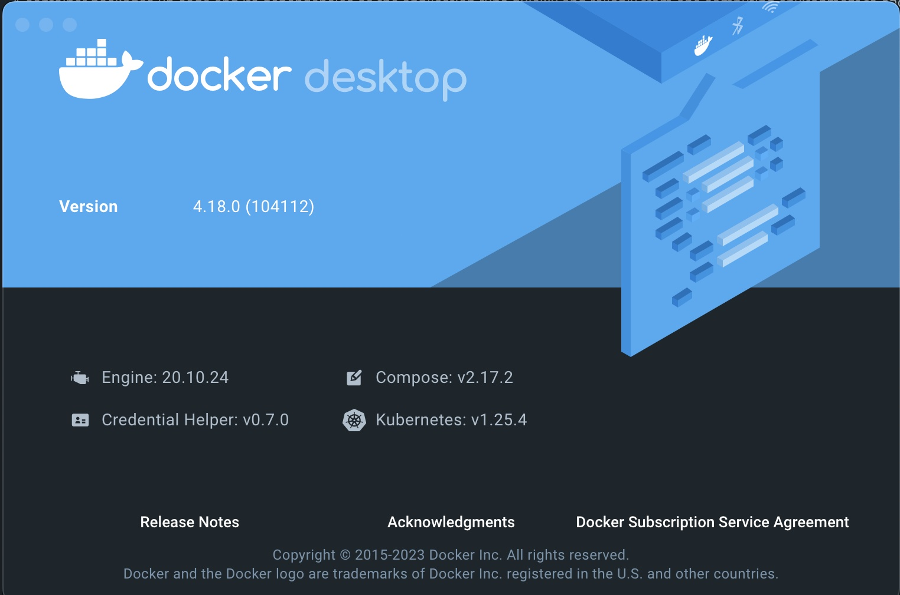

## Setup Local Dev Env with [docker-compose](https://airflow.apache.org/docs/apache-airflow/2.0.2/start/docker.html)

For the previous videos, as you can see, we have to create the virutal enviromnent, install the airflow libraries and the dependencies, run the `airflow db init`, create table, and command `airflow webserver` to run up the webservice and `airflow scheduler` in another virtual environment activate termianl. \
or install the python libraries with constraints, and runs `airflow standalone` to get the airflow up and running.

### Pre-Requirement
Install the docker desktop, once you have the docker desktop app install, you are not necessary to install the compose plugin. 

you can check the compose version by open docker desktop about. \


>Docker is an open-source platform that automates the deployment, scaling, and management of applications. It allows you to package applications and their dependencies into a standardized unit called a container. Containers are lightweight, portable, and can run on any system that supports Docker, ensuring consistency across different environments.

>Docker Compose is a tool for defining and running multi-container Docker applications. It uses a YAML file (docker-compose.yml) to configure the application's services, networks, and volumes. With a single command, you can create and start all the services from your configuration.

### Steps
1. download the docker-compose.yaml file to your current project folder with below command
```sh
curl -LfO 'https://airflow.apache.org/docs/apache-airflow/2.9.2/docker-compose.yaml' ./docker-compose.yaml
```

This file contains services:
- **airflow-scheduler** - The scheduler [monitors](https://airflow.apache.org/docs/apache-airflow/2.0.2/scheduler.html) all tasks and DAGs, then triggers the task instances once their dependencies are complete.
- **airflow-webserver** - The webserver available at http://localhost:8080.
- **airflow-worker** - The worker that executes the tasks given by the scheduler.
- **airflow-init** - The initialization service.
- **flower** - The [flower app](https://flower.readthedocs.io/en/latest/) for monitoring the environment. It is available at http://localhost:8080.
- **postgres** - The database.
- **redis** - The [redis](https://redis.io/) - broker that forwards messages from scheduler to worker.


All these services allow you to run Airflow with CeleryExecutor

2. Init Airflow Environment
If you are the first time to use airlfow, you need to prepare your environment.
- create dags folder to store the dag files
- create the logs folder to store the logs generated by airflow
- create the plugins folder in case you want to extend airflow funciton. 

if you are the beginner, although the plugin folder is not neccesary, i enourage you to follow below command to setup your airflow env.
```sh
mkdir ./dags ./logs ./plugins
echo -e "AIRFLOW_UID=$(id -u)\nAIRFLOW_GID=0" > .env
```

3. init airflow environment
```sh
docker-compose up airflow-init
```

4. run up the airflow services
```sh
docker-compose up
```
you can check the docker instances status by opening other terimal and run `docker ps`

### Running CLI Commands
you can run CLI commands to check airflow info
```sh
docker-compose run airflow-worker airflow info
```
If you are using Linux or Mac OS, you can make your work easier by 
```sh
curl -LfO 'https://airflow.apache.org/docs/apache-airflow/2.0.2/airflow.sh'
chmod +x airflow.sh
```
and run 
```sh
./airflow.sh info
```

You can also use bash as parameter to enter interactive bash shell in the container or python to enter python container.

```sh
./airflow.sh bash

./airflow.sh python
```

### How to use Airflow API
1. add one more environment 
go to docker-compose.yaml file, and add
```
AIRFLOW__API__AUTH_BACKEND: 'airflow.api.auth.backend.basic_auth'
```
2. restart the services by
```sh
docker-compose down && docker-compose up
```

3. you can use CURL to call the airflow APIs
```sh
ENDPOINT_URL="http://localhost:8080/"
curl -X GET  \
    --user "airflow:airflow" \
    "${ENDPOINT_URL}/api/v1/pools"
```

### Clean Env
```sh
docker-compose down --volumes --rmi all
```
terminate all docker instances and image with defined in the docker-compoose file.
